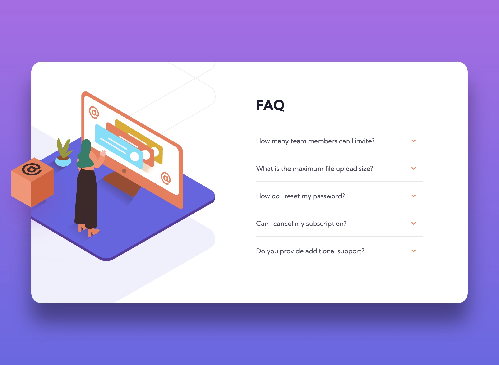

# Frontend Mentor - FAQ accordion card solution

This is a solution to the [FAQ accordion card challenge on Frontend Mentor](https://www.frontendmentor.io/challenges/faq-accordion-card-XlyjD0Oam). Frontend Mentor challenges help you improve your coding skills by building realistic projects. 

## Table of contents

- [Overview](#overview)
  - [The challenge](#the-challenge)
  - [Screenshots](#screenshots)
  - [Links](#links)
- [My process](#my-process)
  - [Built with](#built-with)
  - [What I learned](#what-i-learned)
  - [Continued development](#continued-development)
  - [Useful resources](#useful-resources)
- [Author](#author)

## Overview

### The challenge

Users should be able to:

- View the optimal layout for the component depending on their device's screen size
- See hover states for all interactive elements on the page
- Hide/Show the answer to a question when the question is clicked

### Screenshots

### Links

- Solution URL: [https://github.com/webdevbynight/faq-accordion-card-main](https://github.com/webdevbynight/faq-accordion-card-main)
- Live Site URL: [https://webdevbynight.github.io/faq-accordion-card-main/](https://webdevbynight.github.io/faq-accordion-card-main/)

## My process

### Built with

- Semantic HTML5 markup
- CSS (via SCSS)
  - custom properties
  - pseudo-classes
  - pseudo-elements
  - CSS sprite
- Mobile-first workflow

### What I learned

I learned how to show and hide the answers of the questions without using any line of JavaScript.

### Continued development

Even if I did not feel I spent too much time carrying out this challenge, I still have to learn about how to make front-end development in a more efficient way and to learn to manage to build web pages without seeming to be too slow.

### Useful resources

- [The “Interactive elements” section from the HTML 5 specification](https://html.spec.whatwg.org/multipage/interactive-elements.html#interactive-elements) - This helped me to learn about the `details` and `summary` elements and the `open` attribute.
- [Can I use… HTML element: summary: `display: list-item`](https://caniuse.com/mdn-html_elements_summary_display_list_item) - This helped me about browsers compatibility of the use of `display: list-item` (and therefore of the `list-style-*` properties) on the `summary` element.
- [Quick Reminder that Details/Summary is the Easiest Way Ever to Make an Accordion](https://css-tricks.com/quick-reminder-that-details-summary-is-the-easiest-way-ever-to-make-an-accordion/) - This article helped me to find an excellent solution to carry out the challenge, including its bonus (i.e. to make an accordion without JavaScript).
- [Two Issues Styling the Details Element and How to Solve Them](https://css-tricks.com/two-issues-styling-the-details-element-and-how-to-solve-them/) - This article helped me about some issues when styling a `details` element.
- [Personnaliser le marqueur de révélation](https://developer.mozilla.org/fr/docs/Web/HTML/Element/details#personnaliser_le_marqueur_de_r%C3%A9v%C3%A9lation) - This section of article (in French) gives a tip to customise the disclosure widget on Safari, which does not support the standard way of customising it (at the time when I wrote these lines, the issue concerned Safari 16.4 and lower versions).

## Author

- Website - [@webdevbynight](https://github.com/webdevbynight)
- Frontend Mentor - [@webdevbynight](https://www.frontendmentor.io/profile/webdevbynight)
